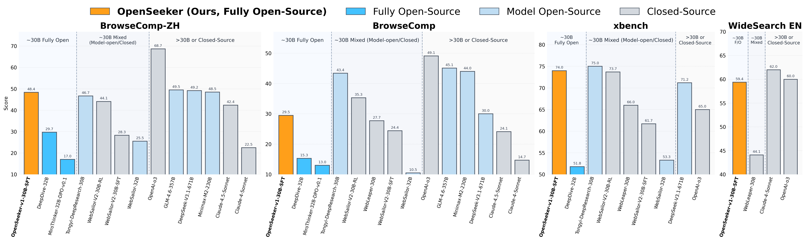

# OpenSeeker: Democratizing Frontier Search Agents by Fully Open-Sourcing Training Data

<div align="center">
  
</div>

## Overview

OpenSeeker is an open-source search agent system that democratizes access to frontier search capabilities by fully open-sourcing its training data. Using **11.7K** training examples, we fine-tuned Qwen3-30B-A3B-Thinking-2507 and achieved **48.4** on BrowseComp-ZH, **29.5** on BrowseComp，**74.0** on xbench-DeepSearch, and **59.4** on WideSearch. Our model even surpasses industrial competitors such as Tongyi DeepResearch on BrowseComp-ZH (**48.4%** vs. **46.7%**), despite Tongyi DeepResearch being trained with extensive continual pre-training, supervised fine-tuning, and reinforcement learning. This project enables researchers and developers to build, evaluate, and deploy advanced search agents for complex information-seeking tasks.

---

### 🌟 Key Achievement

> **OpenSeeker represents the first work by a purely academic team to achieve state-of-the-art performance on frontier search benchmarks while simultaneously open-sourcing the full training data.**

---

## Quick Start

### Installation

Clone the repository and set up the environment:

```bash
# Clone repository
git clone https://github.com/rui-ye/OpenSeeker.git
cd OpenSeeker

# Create conda environment
conda create --name openseeker python=3.10
conda activate openseeker
pip install -r requirements.txt
```

### Model Setup

Download and deploy the OpenSeeker model:

```bash
# 1. Install git-xet (required for downloading the model)
brew install git-xet
git xet install

# 2. Clone the OpenSeeker model repository
git clone https://huggingface.co/OpenSeeker/OpenSeeker-v1-30B-SFT

# 3. Update MODEL_PATH in run_openseeker.sh to point to the downloaded model directory
# Edit run_openseeker.sh and set MODEL_PATH="/path/to/OpenSeeker-v1-30B-SFT"

# 4. Deploy the model server
bash run_openseeker.sh
```

### Configuration

```bash
# Edit setup_env.sh with your API endpoints and keys
source setup_env.sh
```

### Usage

Generate answers and evaluate results:

```bash
# Generate answers for your dataset
python eval/generate_answer.py \
    --dataset_path /path/to/your/dataset.jsonl \
    --out_dir /path/to/output/directory

# Evaluate the generated results
python eval/eval.py \
    --data_path /path/to/output/directory/result_tool200.jsonl \
    --max_workers 20 
```


## Project Structure

```
OpenSeeker/
├── eval/                    # Evaluation scripts
│   ├── eval.py             # Main evaluation script
│   ├── generate_answer.py  # Answer generation script
│   └── prompt.py           # Prompt templates
├── src/                     # Core source code
│   ├── llm_tool_openseeker.py  # LLM tool interface
│   ├── config/             # Configuration files
│   │   └── chat_template.jinja  # Chat template configuration
│   └── tools/               # Tool implementations
│       ├── search.py       # Search tool
│       └── visit.py        # Web visit tool
├── run_openseeker.sh       # Model server startup script
├── setup_env.sh            # Environment variable template
└── README.md               # This file
```


